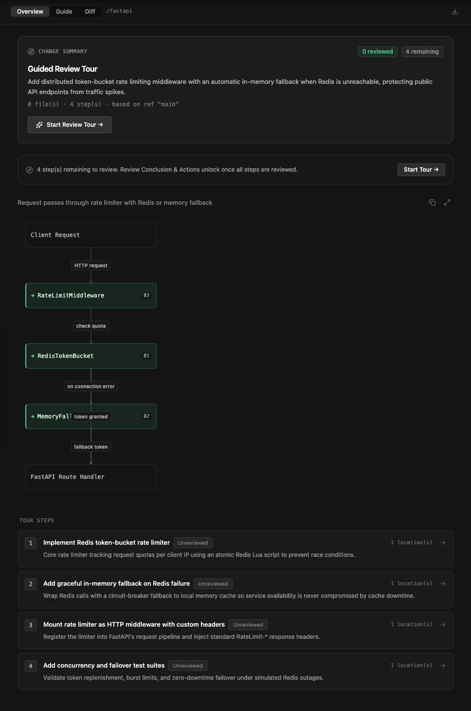
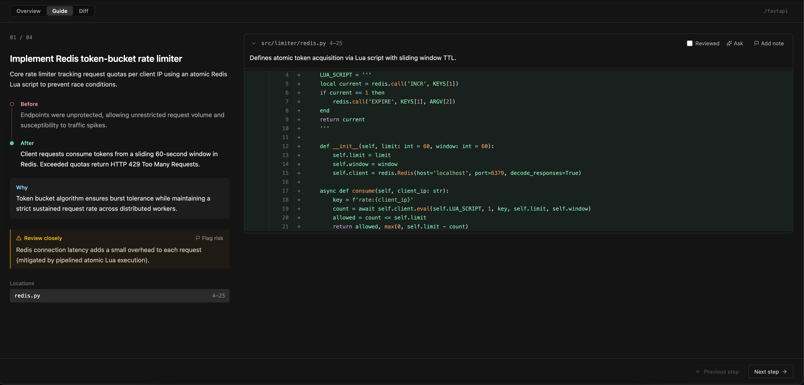
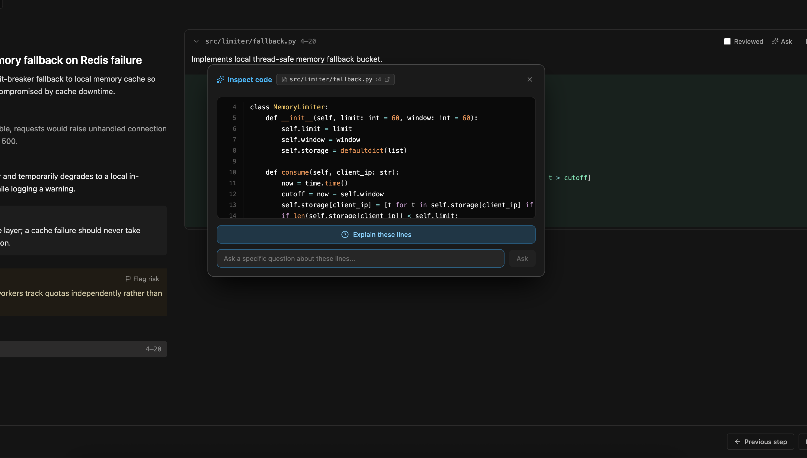
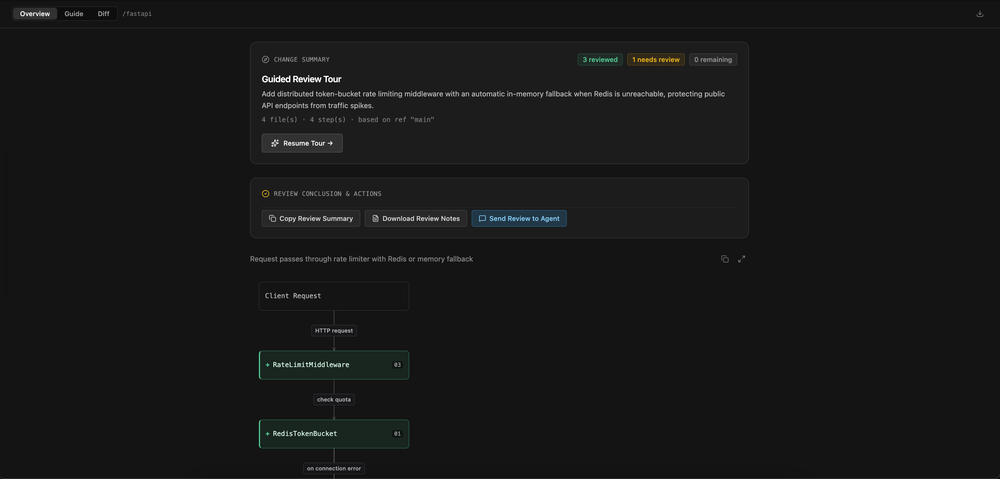
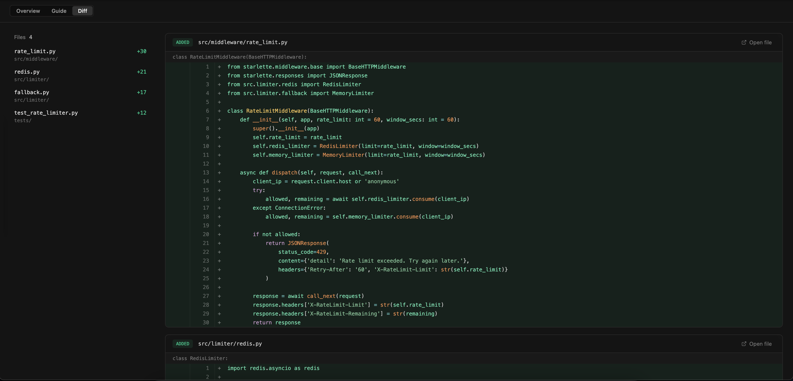

# review-guide

An agent skill that writes a guided code review of a branch or pull request
and opens it as an interactive, step-by-step walkthrough. The agent explains
the change as a goal and a sequence of steps, each anchored to the exact
lines it is about; the result is one portable `REVIEW-GUIDE-<branch>.md`
file.

## Install

```
npx skills add monkey-hq/review-guide
```

This works with any client the `skills` CLI supports (Claude Code, OpenCode,
Codex, Cursor, etc).

## Requirements

`git`, and one JavaScript runtime on your PATH: Node, Bun or Deno. The skill
ships a small script (`review-guide.mjs`) that reads the diff, checks the
agent's steps, writes the guide and serves the reader. There is nothing to
install beyond the skill itself, and no account.

## Use

Ask your agent for a review guide of a branch or a PR. It writes
`REVIEW-GUIDE-<branch>.md` at the top of the checkout being reviewed and
opens it in your browser, served from your own machine.

## Walkthrough

The overview shows the goal, the steps, and a flow chart of how the pieces
connect:



Each step explains one intention of the change beside only the code that
step is about:



Ask the agent questions about any anchored code directly from the review:



Mark steps understood or flag items that need review, then export structured
findings back to the agent session:



Switch to the complete diff whenever you want the full picture:



## Share

The guide is plain Markdown. Send the file to anyone: they drag it into the
[Review Guide reader](https://monkey-reader.sheri11.app) and get the same
walkthrough, with nothing to install.
